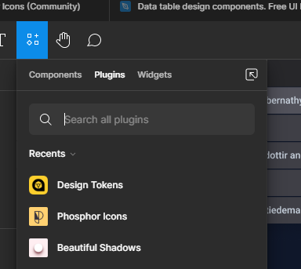
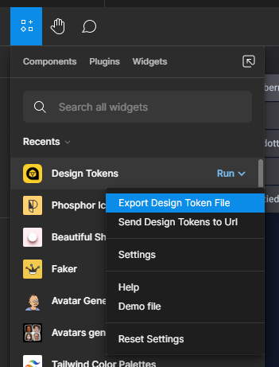
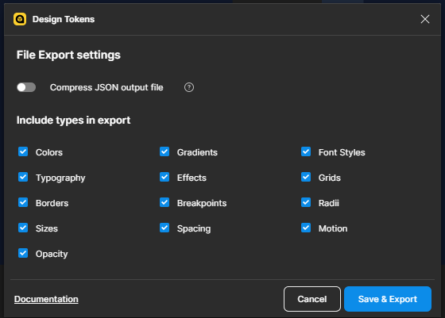

# Figma Token Translator

## Usage

### Exporting Figma Tokens

To export design token by Figma, you need to use a plugin ***'Design Tokens'***.
<br>
<br>
<div align="center">
  
</div>
<br>
<div align="center">
  
</div>
<br>

Now check what you want to export and click on **Save & Export**.
<br>
<div align="center">
  
</div>
<br>

### Translating Tokens
With design tokens in json, run:
```
> figma-token file -fp PATH_TO_DESIGN_TOKEN.json
```

This command generate tokens in python and save on your desktop folder.

Options:
  - "-fp": Path to design tokens
  - "-f": Filename prefix
  - "-o": Type of output **[class, namedtuple, dict, constants]**
  - "-d": Path to save tokens translated
